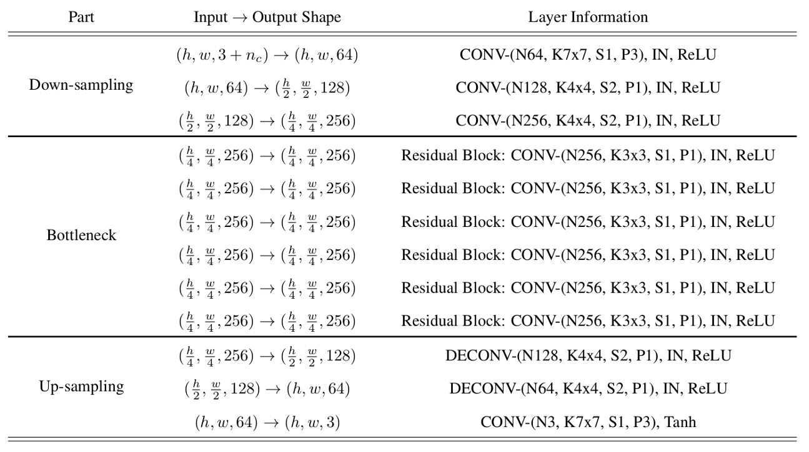
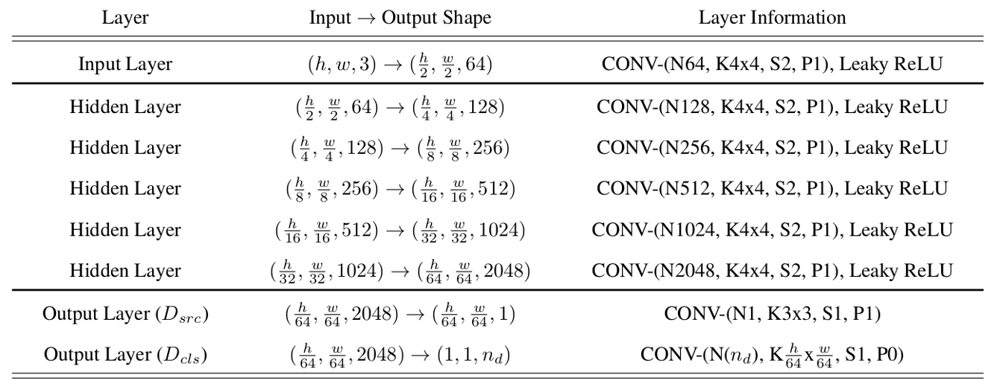
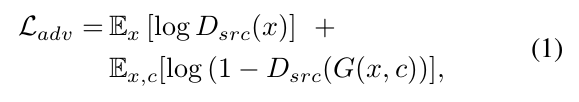
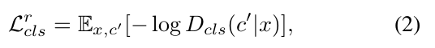
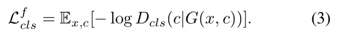
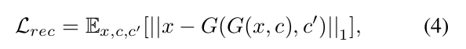
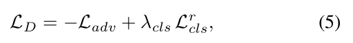
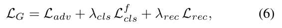

# Face-Attribute-Manipulation

# Architecture
---
### Generator network architecture
<p></p>

### Discriminator network architecture
<p></p>

###### Note:
&nbsp;&nbsp; h - image height,
&nbsp;&nbsp; w - image widht,
&nbsp;&nbsp; nd - the number of domains,
&nbsp;&nbsp; nc - the dimension of domain labels, same as nd,
&nbsp;&nbsp; N - the number of output channels,
&nbsp;&nbsp; K - kernel size,
&nbsp;&nbsp; S - stride size,
&nbsp;&nbsp; P - padding size,
&nbsp;&nbsp; IN - instance normalization,

# Losses
<p></p>
<p></p>
<p></p>
<p></p>
<p></p>
<p></p>

###### Note:
&nbsp;&nbsp; (1) - adversarial loss,
&nbsp;&nbsp; (2) - domain classification loss of real images,
&nbsp;&nbsp; (3) - domain classification loss of fake iamges,
&nbsp;&nbsp; (4) - reconstruction loss,
&nbsp;&nbsp; (5) - discriminator loss,
&nbsp;&nbsp; (6) - generator loss,

# Usage
---
##### 1. Download dataset into ```./dataset```. It should be like this:
```
dataset
    CelebA
        anno
             original.txt
        imgs
            img1.jpg
            ...
            imgn.jpg
```
Where ```original.txt``` is a text file with images name and annotations.

##### 2. Run the following command to create the necessary folders and build dataset
```bash
$ python setup.py
```

##### 3. Main
##### &nbsp;&nbsp; Training
```bash
$ python main.py --train
```
##### &nbsp;&nbsp; Resume training
```bash
$ python main.py --train --resume
```
